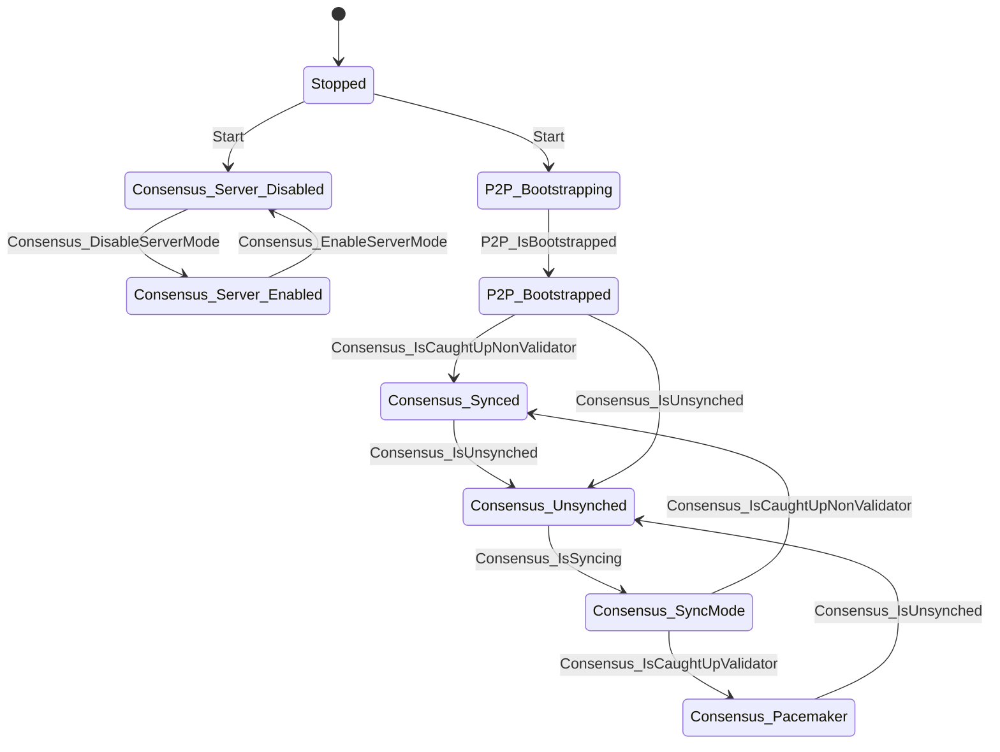

# Node Finite State Machine

The following diagram displays the various states and events that govern the functionality of the node.

```mermaid
stateDiagram-v2
    [*] --> Stopped
    Consensus_Pacemaker --> Consensus_Unsynched: Consensus_IsUnsynched
    Consensus_Server_Disabled --> Consensus_Server_Enabled: Consensus_DisableServerMode
    Consensus_Server_Enabled --> Consensus_Server_Disabled: Consensus_EnableServerMode
    Consensus_SyncMode --> Consensus_Synced: Consensus_IsCaughtUpNonValidator
    Consensus_SyncMode --> Consensus_Pacemaker: Consensus_IsCaughtUpValidator
    Consensus_Synced --> Consensus_Unsynched: Consensus_IsUnsynched
    Consensus_Unsynched --> Consensus_SyncMode: Consensus_IsSyncing
    P2P_Bootstrapped --> Consensus_Synced: Consensus_IsCaughtUpNonValidator
    P2P_Bootstrapped --> Consensus_Unsynched: Consensus_IsUnsynched
    P2P_Bootstrapping --> P2P_Bootstrapped: P2P_IsBootstrapped
    Stopped --> Consensus_Server_Disabled: Start
    Stopped --> P2P_Bootstrapping: Start
```