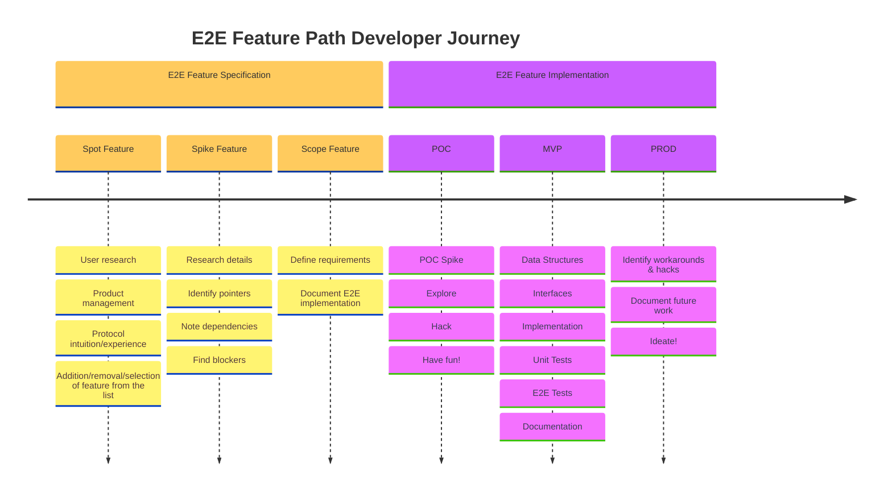

# E2E Feature Path <!-- omit in toc -->

_IMPROVE: Add links to every step once we have gone through the whole process at least once._

- [Introduction \& Goals](#introduction--goals)
- [Developer Journey](#developer-journey)
- [Feature Specification](#feature-specification)
  - [Spot E2E Feature](#spot-e2e-feature)
  - [Spike E2E Feature](#spike-e2e-feature)
  - [Scope E2E Feature](#scope-e2e-feature)
    - [GitHub Ticket](#github-ticket)
    - [Origin Document](#origin-document)
- [E2E Feature Implementation](#e2e-feature-implementation)
  - [POC: Proof of Concept](#poc-proof-of-concept)
  - [MVP: Minimum Viable Product](#mvp-minimum-viable-product)
  - [PROD: Production](#prod-production)

## Introduction & Goals

The [Pocket Network Specification](https://github.com/pokt-network/pocket-network-protocol/tree/main/utility) implementation has been driven by various [milestones](https://github.com/pokt-network/pocket/milestones) and protocol/module/component specific tasks such as validator/session/utility respectively. Every feature crosses the boundary of business logic, data types and interfaces for different components. Due to the nature of the complexity of implementing these, a different approach has been designed.

**The goal** of this document is to create a well defined process for how we should follow an end-to-end feature path approach, where each feature/task spans multiple protocols/modules/components but easier easier to scope, reason about, design and implement.

## Developer Journey



## Feature Specification

### Spot E2E Feature

Add or select one of the features from the Utility E2E feature list [here](./E2E_FEATURE_LIST.md).

### Spike E2E Feature

Create a SPIKE GitHub issue such as [this](<[http](https://github.com/pokt-network/pocket/issue/TODO_LINK_TO_ISSUE_ONCE_WE_HAVE_EXAMPLE)>) to scope out the feature. This ticket is responsible for creating the ticket that'll track the work.

### Scope E2E Feature

Use the results from the SPIKE to create an implementation GitHub issue such as [this](<[http](https://github.com/pokt-network/pocket/issue/TODO_LINK_TO_ISSUE_ONCE_WE_HAVE_EXAMPLE)>) to track the actual implementation.

#### GitHub Ticket

Following the GitHub template we have [here](https://github.com/pokt-network/pocket/blob/main/.github/ISSUE_TEMPLATE/issue.md), create a [new issue](https://github.com/pokt-network/pocket/issues/new?assignees=&labels=&projects=&template=issue.md&title=%5BREPLACE+ME%5D+with+a+descriptive+title) with the following components:

**Objective**: `Implement MVP E2E Feature Path <Letter>.<Number>: <Name>`

**Origin Document**: _Insert the details from the [origin document[#origin-doc] below_

**Goals**:

- MVP implementation of the E2E Feature Path in the objective
- Identification of follow-up work and testing requirements to bring the feature to production

**Deliverables**:

- **POC**:
  - [ ] A POC SPIKE that will be closed and split into multiple PRs
- **MVP**:
  - [ ] A PR that adds or updates relevant structures and interfaces; such as [shared/core/types/proto](https://github.com/pokt-network/pocket/tree/main/shared/core/types/proto), [shared/modules](https://github.com/pokt-network/pocket/tree/main/shared/modules), etc
  - [ ] A PR that implements an MVP of the feature w/ unit tests
  - [ ] A PR that adds a new E2E testing feature with **one happy** and **one sad** path scenario as described in the origin document (see [e2e/README.md](https://github.com/pokt-network/pocket/blob/main/e2e/README.md)); this may require additions the [cli](https://github.com/pokt-network/pocket/tree/main/app/client)
  - [ ] A PR that updates all relevant documentation
- **PROD**:
  - [ ] One or more follow-up GitHub issues that track future that my include, but not limited to:
    - Increase test coverage
    - Adding subsequent features
    - Patching hacks or workaroudns
    - Your [imagination](https://github.com/pokt-network/pocket/assets/1892194/6aff9004-8d3b-48e8-b6d5-9b67ac266e3d)!

#### Origin Document

**Purpose:** A single sentence that captures the intended purpose, behaviour and goal of the E2E feature
**Actors**: Check all of the protocol actors involved in the feature:

- [ ] Validator
- [ ] Application
- [ ] Servicer
- [ ] Fisherman
- [ ] Portal

**Data Structures**:

- A list of the core types (protobufs, structs, etc) that will be used, added or modified in this feature
- Mention or link to specific files if applicable
- See [shared/core/types/proto](https://github.com/pokt-network/pocket/tree/main/shared/core/types/proto) as a reference as they will most likely, but not necessarily, be part of that package
- _TIPS:_

  - _This will be non-exhaustive and will likely change during the POC or MVP stages_
  - You can find all other structs by running this command:

    ```bash
    grep -r "type .* struct" --exclude-dir="vendor" --exclude="*.gen.go" --exclude="*.pb.go" .
    ```

  - You can find all other protobufs by running this command:

    ```bash
    find . -name "*.proto" -not -path "./vendor/*"`
    ```

**Interfaces**:

- A list of the interface (go interface, placeholder functions, grpc, etc) that will be used, added or modified in this feature
- Mention or link to specific files if applicable
- See [shared/modules](https://github.com/pokt-network/pocket/tree/main/shared/modules) as a reference as they will most likely, but not necessarily, be part of that package
- _TIPS:_

  - _This will be non-exhaustive and will likely change during the POC or MVP stages_
  - You can find all other structs by running this command:

    ```bash
    grep -r "type .* interface" --exclude-dir="vendor" --exclude="*.gen.go" --exclude="*.pb.go" .
    ```

  - You can find all other protobufs by running this command:

    ```bash
    find . -name "*.proto" -not -path "./vendor/*"`
    ```

**Diagram**:

- _One or more mermaid diagrams that will visualize the E2E feature_
- _TIPs:_
  - Use multiple diagrams if a single one ends up exceeding 7 or more core elements or steps
  - See if there’s anything in [pokt-network/pocket-network-protocol/tree/main/utility](https://github.com/pokt-network/pocket-network-protocol/tree/main/utility) or [pokt-network/pocket/tree/main/utility/doc](https://github.com/pokt-network/pocket/tree/main/utility/doc) that you can use as a starting point

**User Stories as Tests**:

- Use natural language (long-form or bullet points) to define:
  - One (or more) HAPPY E2E path(s) from start to end with all the relevant details
  - One (or more) SAD e2e path(s) from start to end with all the relevant details
- _NOTE: Keep in mind that these tests will be used to:_
  - _Interact with our [CLI](../../app/client/cli/) and E2E testing framework but do not design it for that_
  - _Train ChatGPT to expand on the happy and sad E2E test cases_
  - _TODO(@Bryan White @Daniel Olshansky ) :_ Present a template for how to formulate this to be primarily used in the earlier stages of MVP feature implementation until we have a structure to feed ChatGPT

**Blockers**:

- A list of other E2E feature paths (in the format `<Letter>.<Number>: <Name>`) that:
  - must be implemented prior to this
  - will be mocked or be added as placeholders as part of this
- Any other blockers, requirements or dependencies this will need and may need to be implemented as part of the feature implementation

## E2E Feature Implementation

_IMPROVE: Add links to every step once we have gone through the whole process at least once._

### POC: Proof of Concept

Create a single PR where you _"do everything"_ with the knowledge that it'll be closed without being merged in. This is an opportunity to get your hands dirty, understand the problem more deeply and have some fun. This PR may be split into multiple smaller PRs or just refactored altogether.

_TODO: Link to Alessandro's KISS or Bryan's P2P._

### MVP: Minimum Viable Product

This is the 🥩 (or 🥙) of the whole feature. In several PRs, you will implement, get feedback and merge in the feature to the main branch. Use your best judgment on how to split it so it's easier for the reviewer to give feedback without blocking yourself. It'll include some, or all, of the following PRs:

- Updates to data structures or protobufs
- Updates to interfaces
- Updates to the CLI
- Updates to the RPC

- [ ] A PR that adds or updates relevant structures and interfaces (e.g. in [shared/core/types/proto](../../shared/core/types/proto), [shared/modules](../../shared/modules) or elsewhere)
- [ ] A PR that implements an MVP of the feature w/ unit tests
- [ ] A PR that adds a new E2E testing feature with one happy and one sad path scenario as described in the origin document (see [e2e/README.md](https://github.com/pokt-network/pocket/blob/main/e2e/README.md)); may require additions the [cli](https://github.com/pokt-network/pocket/tree/main/app/client)
- [ ] A PR that updates all relevant documentation

### PROD: Production

One or more follow-up GitHub issues that track follow-up work that my include, but not limited to:

- Increase the test coverage
- Adding subsequent features
- Fixing hacks
- Your [imagination](https://github.com/pokt-network/pocket/assets/1892194/6aff9004-8d3b-48e8-b6d5-9b67ac266e3d)!
