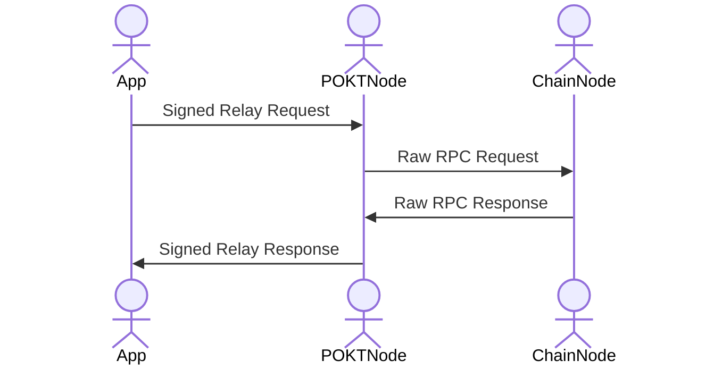
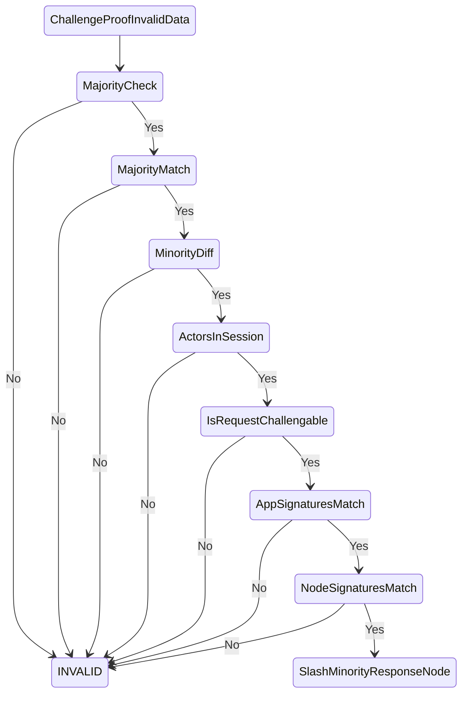

# Client Side Challenges

## Goal

Define a mechanism that allows for applications to report nodes which respond
with correct responses. Additionally, the mechanism should attempt to conform
to the following desired properties:

1. A non-interactive mechanism
2. Agnostic to the underlying blockchain API implementation
3. The mechanism should not limit existing reward generating APIs

## Assumptions

1. The underlying Relays are backed by blockchain API clients.
2. The Application is responsible for identifying and reporting incorrect
   service.
3. The Application cannot identify the lack of a response as incorrect service.
4. Correct service is defined as the majority response within the session.

## Foundations

We should expect that service between a single application and service node
pair to operate as follows:



In a given Session, the Application has the ability to make the same request
to up to $S :=$ `pocketcore/SessionNodeCount` individual nodes.

This relationship means that the best definition of enforceable correctness,
would be the majority response of the nodes in the session.

## Honest Majority Based Correctness Applied to Blockchain APIs

Given that we have access to up to $S$ independent blockchain API clients,
across those $S$ components, we can only ever expect our session to be, at
best, ***eventually consistent***. While an individual blockchain API client
will independently remain ***strongly consistent***, since the state propagates
through the network via peer-to-peer communications, a collection of these
nodes forms an ***eventually consistent*** system in aggregate. At worst
however, depending on the underlying logic of the exposed blockchain API
method, its likely that the session offers ***no consistency***.

### Client Side Challenge Requirements

At minimum, client side challenges can only occur on methods that are
***idempotent*** and ***eventually consistent*** across a group of nodes.

The underlying response being ***eventually consistent*** means that nodes who
respond with an error response that indicates the desired resource could not be
found must be assumed to be operating as expected without further logic
defining SLA expectations of individual methods.

The **idempotency** requirement of the challenge is to prevent the following
situations from happening when a node is operating in good faith:

- DoS through chain bloat from an app submitting thousands of valid challenge
  transactions.
- Attacks on other node stakes in the situation that client side challenges
  result in a net loss for the nodes who fail them.
- Illegitimate reward farming for apps in the situation that client side
  challenges result in a net gain for the app that executes the challenge.

Additionally, to remain non-interactive, it needs to be the case that the
relay request is inferable from the result of the relay response.

### Client Side Challenge Mechanism

At the time of whitelisting a relay chain for rewards, it will be required to
able provide a pattern string that will pattern match to identify if a request
is unable to be client-side challenged.

This will require that the `pocketcore/SupportedBlockchains` parameter take
the following form:

```go
type SupportedBlockchains struct {
   Blockchains []SupportedBlockchain
}

type SupportedBlockchain struct {
    RelayChainID string
    NotChallengablePatterns []string
}
```

The `NotChallengablePatterns` field is an array of pattern strings that should
successfully match against the raw request string should if the request is not
able to be client side challenged. This means having to make a change to what
is expected of the app when requesting a Relay so that the App will send along
a signed version of the string encoded HTTP request.

```go
type QueryRelayRequest stuct {
    Payload       RelayPayload
    SignedPayload string
    Meta          RelayMetadata
    Proof         RelayProof
}
```

Then what is expected of the node when responding to a relay is the following
`RelayResponse`, where the `Signature` field is now the `Signature` of the
App's original signed payload appended with the `Response` string.

```go
type RelayResponse struct {
	Signature string
    Request   string
	Response  string
	Proof     RelayProof
}
```

From here, the client side challenge is to be initiated from a transaction
message sent with the following type:

```go
type ChallengeProofInvalidData struct {
	MajorityResponses []RelayResponse
	MinorityResponse  RelayResponse
	ReporterAddress   Address
}
```

From here, the following logical checks must be made:



If it is the case that the challenge was a valid posted challenge, then the
node that produced the minority response should be slashed to the extent of the
reward that it had otherwise earned.

### Economic Security Guarantees

The idempotency requirement however does not protect against the above when the
same actor controls:

- $50\% + 1$ of the $S$ nodes in a session
- The application sending the requests

Assuming there is a hard limit to the number of challenge transactions that can
be included in a block, call it $L$, then the cost to have the opportunity to
take down the chain can be probabilistically modeled.

For a given relay chain ID, assume that there exists $a$ existing apps, and
there are $n$ total existing nodes already staked for the relay chain.

The probability of a single node being selected for a session should be
$\frac{1}{n}$.

As session selection currently happens as random selection with replacement,
then we can represent the probability of controlling the majority of a session
as the probability of having between $\lfloor \frac{S}{2} \rfloor + 1$ and $S$
successes in $S$ attempts of an $\frac{m}{n}$ discrete event, assuming that $m$
represents the total number of nodes that the actor has staked on that relay
chain. We model this using the binomial distribution, with $p = \frac{m}{n}$
and
$n \in \lbrace \lfloor \frac{S}{2} \rfloor + 1, \lfloor \frac{S}{2} \rfloor+ 2, ..., S \rbrace$

$$
P_{MC}(m,n,S) := \sum_{k=\lfloor \frac{S}{2} \rfloor + 1}^{S}{\binom{S}{k} \left(\frac{m}{n}\right)^{k}\left(1 - \frac{m}{n}\right)^{S-k}}
$$

This is the probability of controlling a session for an arbitrary app. Assuming
that the same actor controls $a$ apps, then the probability that the actor is
able to fully control at least one session for their own application would be:

$$
P_{SD}(a,m,n,S) := 1 - \left(1 - P_{MC}(m,n,S)\right)^{a}
$$

Assuming that there is a fundamental limit to the number of transactions that
can be handled by the protocol for a given block, call it $T$, then we can
measure the cost of the chance to be able to artificially generate $T$ valid
client side challenge transactions.

Then given $R :=$ `application/BaseRelaysPerPOKT`, $B :=$
`pos/BlocksPerSession`, and $N :=$ `pos/StakeMinimum`, the cost of a configuration
of $a$ app stakes and $m$ node stakes, for which the probability of capturing a session
can be calculated via $P_{SD}$, is computed as follows:

$$
C(a,m,R,S,B,N,T) = \frac{100aBST}{R} + mN
$$

