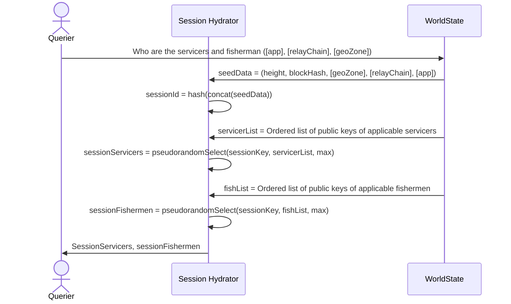

# Session Protocol <!-- omit in toc -->

- [Interface](#interface)
- [Session Creation Flow](#session-creation-flow)

*WIP: Run `TODO*SEARCH=utility/session* make todo*search` to identify all the WIP related to session generation.\*

## Interface

`Pocket` satisfies the V1 Utility Specification's Session Protocol by implementing the following function from the [Utility Module Interface](../../shared/modules/utility_module.go) and returning a [Session Protobuf](../../shared/core/types/proto/session.proto):

```go
GetSession(appAddr string, sessionHeight int64, relayChain string, geoZone string) (*coreTypes.Session, error)
```

## Session Creation Flow

The following is a simplification of the session creation flow for illustrative purposes only.

See [session.go](../session.go) and [session_test.go](../session_test.go) for the full implementation.

1. Create a session object from the seed data
2. Create a key concatenating and hashing the seed data
   - `sessionId = Hash(sessionHeight + blockHash + geoZone + relayChain + appPublicKey)`
3. Get an ordered list of the public keys of servicers and fishermen who are:
   - actively staked
   - staked within geo-zone
   - staked for relay-chain
4. Use a pseudo-random selection algorithm to retrieve the fishermen and servicers for for the sessionId



<!-- GITHUB_WIKI: utility/session_protocol -->
