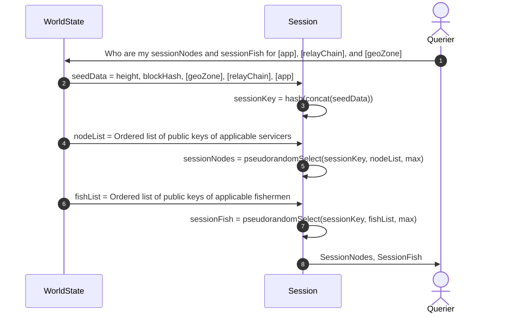
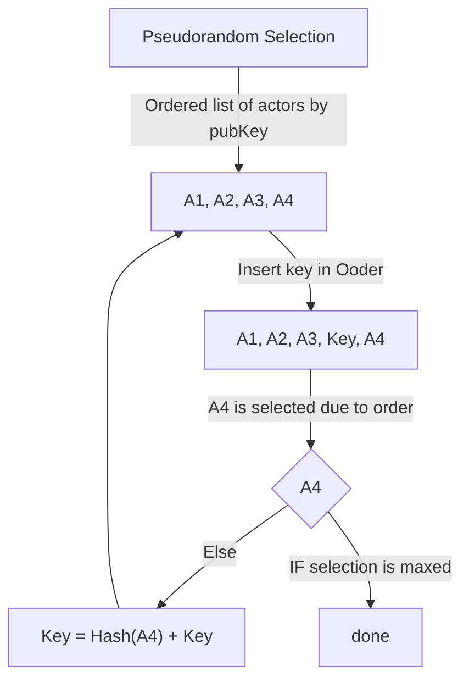

## Protocols

### Session Protocol

`Pocket` implements the V1 Utility Specification's Session Protocol by satisfying the following interface:

```golang
type Session interface {
    NewSession(sessionHeight int64, blockHash string, geoZone GeoZone, relayChain RelayChain, application *coreTypes.Actor) (Session, types.Error)
    GetServicers() []*coreTypes.Actor // the Servicers providing Web3 access to the Application
    GetFishermen() []*coreTypes.Actor    // the Fishermen monitoring the Servicers
    GetApplication() *coreTypes.Actor    // the Application consuming Web3 access
    GetRelayChain() RelayChain        // the identifier of the web3 Relay Chain
    GetGeoZone() GeoZone              // the geolocation zone where the Application is registered
    GetSessionHeight() int64          // the block height when the Session started
}
```

#### Session Creation Flow

1. Create a session object from the seed data (see #2)
2. Create a key concatenating and hashing the seed data
   - `key = Hash(sessionHeight + blockHash + geoZone + relayChain + appPublicKey)`
3. Get an ordered list of the public keys of servicers who are:
   - actively staked
   - staked within geo-zone
   - staked for relay-chain
4. Pseudo-insert the session `key` string into the list and find the first actor directly below on the list
5. Determine a new seedKey with the following formula: ` key = Hash( key + actor1PublicKey )` where `actor1PublicKey` is the key determined in step 4
6. Repeat steps 4 and 5 until all N servicers are found
7. Do steps 3 - 6 for Fishermen as well

### FAQ

- Q) why do we hash to find a newKey between every actor selection?
- A) pseudo-random selection only works if each iteration is re-randomized or it would be subject to lexicographical proximity bias attacks

- Q) Why do we not use Golang's `rand.Intn` with the key as a seed for random node selection?
- A) A proprietary randomization algorithm makes this approach language & library agnostic, so any client simply has to follow the specifications

- Q) what is `WorldState`?
- A) it represents a queryable view on the internal state of the network at a certain height.

- Q) Do Fishermen stake for a specific RelayChain?
- A) Fishermen are only going to be applicable to Pocket Supported Relay Chains (where the protocol pays out for the relay chain). It is unclear at this time what the limitations and scoping will be for Fishermen RelayChain support.

- Q) What was the reasoning not to allow a list of geozones?
- A) Each session is mono-chain and mono-geo. This is fundamental as it would create even more possible combinations of sessions and increase computational complexity during block production and servicing

### Session Flow



### Pseudorandom Selection



<!-- GITHUB_WIKI: utility/session_protocol -->
