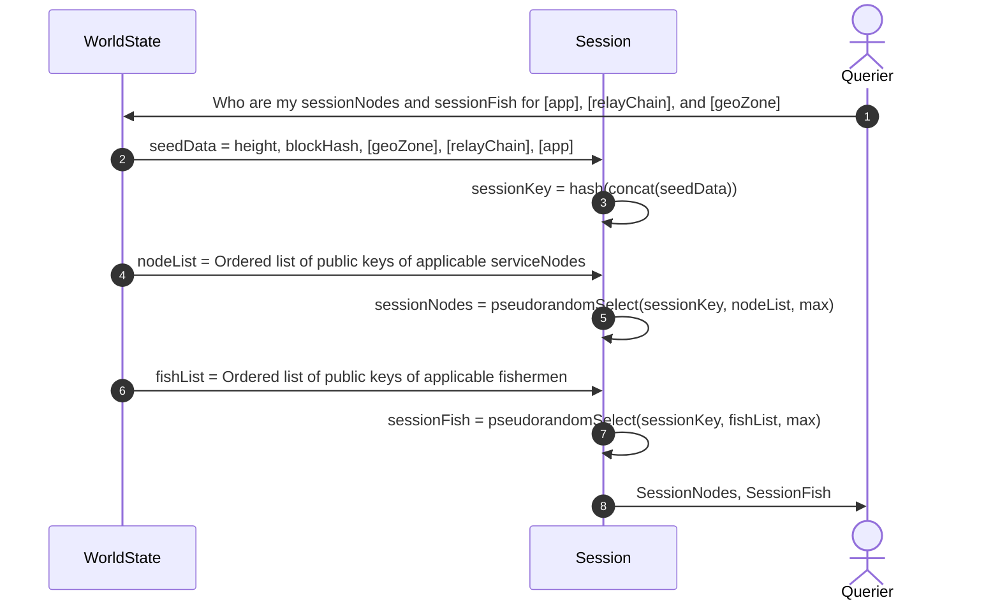
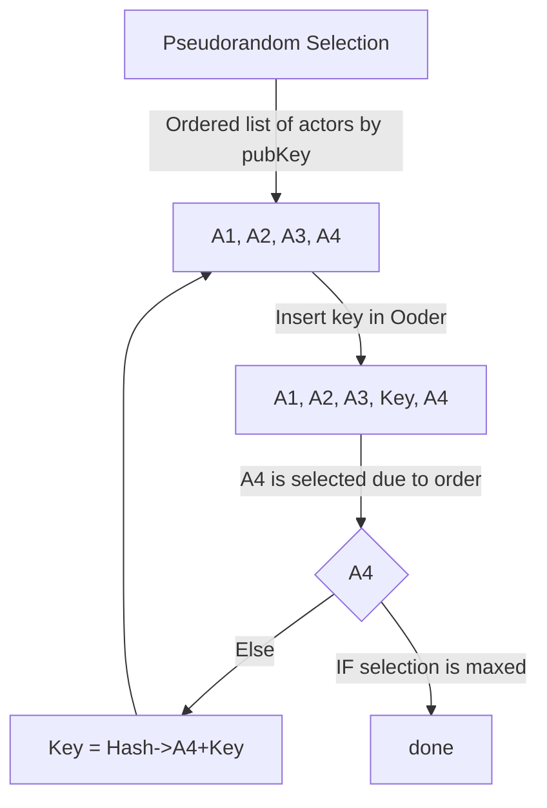

# Utility Module

This document is meant to be a placeholder to serve as a living representation of the parent 'Utility Module' codebase until the code matches the [1.0 Utility Module specification](https://github.com/pokt-network/pocket-network-protocol/tree/main/utility).

The spirit of the documentation is to continuously update and inform the reader of the general scope of the Utility Module as breaking, rapid development occurs.

_This document will be archived once the implementation is synonymous with the current 1.0 Utility specification, ._

# Origin Document

Currently, the Utility Module minimally implements the first iteration of an account based, state machine, blockchain protocol.

Synonymous technologies to this current iteration are 'MVP proof of stake' blockchain state machines, that are NOT Pocket Network specific.

The current implementation does add the fundamental Pocket Network 1.0 actors:

- Accounts
- Validators
- Fishermen
- Applications
- Service Nodes

And implement the basic transaction functionality:

- Send
- Stake
- Unstake
- EditStake
- Pause
- Unpause

Added governance params:

- BlocksPerSessionParamName

- AppMinimumStakeParamName
- AppMaxChainsParamName
- AppBaselineStakeRateParamName
- AppStakingAdjustmentParamName
- AppUnstakingBlocksParamName
- AppMinimumPauseBlocksParamName
- AppMaxPauseBlocksParamName

- ServiceNodeMinimumStakeParamName
- ServiceNodeMaxChainsParamName
- ServiceNodeUnstakingBlocksParamName
- ServiceNodeMinimumPauseBlocksParamName
- ServiceNodeMaxPauseBlocksParamName
- ServiceNodesPerSessionParamName

- FishermanMinimumStakeParamName
- FishermanMaxChainsParamName
- FishermanUnstakingBlocksParamName
- FishermanMinimumPauseBlocksParamName
- FishermanMaxPauseBlocksParamName

- ValidatorMinimumStakeParamName
- ValidatorUnstakingBlocksParamName
- ValidatorMinimumPauseBlocksParamName
- ValidatorMaxPausedBlocksParamName
- ValidatorMaximumMissedBlocksParamName

- ValidatorMaxEvidenceAgeInBlocksParamName
- ProposerPercentageOfFeesParamName
- MissedBlocksBurnPercentageParamName
- DoubleSignBurnPercentageParamName

- MessageDoubleSignFee
- MessageSendFee
- MessageStakeFishermanFee
- MessageEditStakeFishermanFee
- MessageUnstakeFishermanFee
- MessagePauseFishermanFee
- MessageUnpauseFishermanFee
- MessageFishermanPauseServiceNodeFee
- MessageTestScoreFee
- MessageProveTestScoreFee
- MessageStakeAppFee
- MessageEditStakeAppFee
- MessageUnstakeAppFee
- MessagePauseAppFee
- MessageUnpauseAppFee
- MessageStakeValidatorFee
- MessageEditStakeValidatorFee
- MessageUnstakeValidatorFee
- MessagePauseValidatorFee
- MessageUnpauseValidatorFee
- MessageStakeServiceNodeFee
- MessageEditStakeServiceNodeFee
- MessageUnstakeServiceNodeFee
- MessagePauseServiceNodeFee
- MessageUnpauseServiceNodeFee
- MessageChangeParameterFee

- AclOwner
- BlocksPerSessionOwner
- AppMinimumStakeOwner
- AppMaxChainsOwner
- AppBaselineStakeRateOwner
- AppStakingAdjustmentOwner
- AppUnstakingBlocksOwner
- AppMinimumPauseBlocksOwner
- AppMaxPausedBlocksOwner
- ServiceNodeMinimumStakeOwner
- ServiceNodeMaxChainsOwner
- ServiceNodeUnstakingBlocksOwner
- ServiceNodeMinimumPauseBlocksOwner
- ServiceNodeMaxPausedBlocksOwner
- ServiceNodesPerSessionOwner
- FishermanMinimumStakeOwner
- FishermanMaxChainsOwner
- FishermanUnstakingBlocksOwner
- FishermanMinimumPauseBlocksOwner
- FishermanMaxPausedBlocksOwner
- ValidatorMinimumStakeOwner
- ValidatorUnstakingBlocksOwner
- ValidatorMinimumPauseBlocksOwner
- ValidatorMaxPausedBlocksOwner
- ValidatorMaximumMissedBlocksOwner
- ValidatorMaxEvidenceAgeInBlocksOwner
- ProposerPercentageOfFeesOwner
- MissedBlocksBurnPercentageOwner
- DoubleSignBurnPercentageOwner
- MessageDoubleSignFeeOwner
- MessageSendFeeOwner
- MessageStakeFishermanFeeOwner
- MessageEditStakeFishermanFeeOwner
- MessageUnstakeFishermanFeeOwner
- MessagePauseFishermanFeeOwner
- MessageUnpauseFishermanFeeOwner
- MessageFishermanPauseServiceNodeFeeOwner
- MessageTestScoreFeeOwner
- MessageProveTestScoreFeeOwner
- MessageStakeAppFeeOwner
- MessageEditStakeAppFeeOwner
- MessageUnstakeAppFeeOwner
- MessagePauseAppFeeOwner
- MessageUnpauseAppFeeOwner
- MessageStakeValidatorFeeOwner
- MessageEditStakeValidatorFeeOwner
- MessageUnstakeValidatorFeeOwner
- MessagePauseValidatorFeeOwner
- MessageUnpauseValidatorFeeOwner
- MessageStakeServiceNodeFeeOwner
- MessageEditStakeServiceNodeFeeOwner
- MessageUnstakeServiceNodeFeeOwner
- MessagePauseServiceNodeFeeOwner
- MessageUnpauseServiceNodeFeeOwner
- MessageChangeParameterFeeOwner

And minimally satisfy the following interface:

```go
CheckTransaction(tx []byte) error
GetProposalTransactions(proposer []byte, maxTransactionBytes int, lastBlockByzantineValidators [][]byte) (transactions [][]byte, err error)
ApplyBlock(Height int64, proposer []byte, transactions [][]byte, lastBlockByzantineValidators [][]byte) (appHash []byte, err error)
```

## Protocols

### Session Protocol
`Pocket` implements the V1 Utility Specification's Session Protocol by satisfying the following interface:

```golang
type Session interface {
	NewSession(sessionHeight int64, blockHash string, geoZone GeoZone, relayChain RelayChain, application modules.Actor) (Session, types.Error)
    GetServiceNodes() []modules.Actor // the ServiceNodes providing Web3 access to the Application
    GetFishermen() []modules.Actor    // the Fishermen monitoring the Service Nodes
    GetApplication() modules.Actor    // the Application consuming Web3 access
    GetRelayChain() RelayChain        // the identifier of the web3 Relay Chain
    GetGeoZone() GeoZone              // the geolocation zone where the Application is registered
    GetSessionHeight() int64          // the block height when the Session started
}
```

#### Session Creation Flow

1) Create a session object from the seed data (see #2)
2) Create a key concatenating and hashing the seed data
    - `key = Hash(sessionHeight + blockHash + geoZone + relayChain + appPublicKey)`
3) Get an ordered list of the public keys of serviceNodes who are:
    - actively staked
    - staked within geo-zone
    - staked for relay-chain
4) Pseudo-insert the session `key` string into the list and find the first actor directly below on the list
5) Determine a new seedKey with the following formula: ` key = Hash( key + actor1PublicKey )` where `actor1PublicKey` is the key determined in step 4
6) Repeat steps 4 and 5 until all N serviceNodes are found
7) Do steps 3 - 6 for Fishermen as well

### FAQ

- Q) why do we hash to find a newKey between every actor selection?
- A) pseudo-random selection only works if each iteration is re-randomized or it would be subject to lexicographical proximity bias attacks

- Q) what is `WorldState`?
- A) it represents a queryable view on the internal state of the network at a certain height.
### Session Flow



### Pseudorandom Selection



## How to build

Utility Module does not come with its own cmd executables.

Rather, it is purposed to be a dependency (i.e. library) of other modules

## How to use

Utility implements the `UtilityModule` and subsequent interface
[`pocket/shared/modules/utility_module.go`](https://github.com/pokt-network/pocket/shared/modules/utility_module.go).

To use, simply initialize a Utility instance using the factory function like so:

```go
utilityMod, err := utility.Create(config)
```

and use `utilityMod` as desired.

## How to test

```
$ make test_utility_types && make test_utility_module
```

## Code Organization

```bash
utility
├── account.go     # utility context for accounts & pools
├── actor.go       # utility context for apps, fish, nodes, and validators
├── block.go       # utility context for blocks
├── gov.go         # utility context for dao & parameters
├── module.go      # module implementation and interfaces
├── session.go     # utility context for the session protocol
├── transaction.go # utility context for transactions including handlers
├── doc            # contains the documentation and changelog
├── test           # utility unit tests
├── types          # stateless (without relying on persistence) library of utility types
│   ├── proto          # protobuf3 messages that auto-generate into the types directory
│   ├── actor.go
│   ├── error.go
│   ├── mempool.go
│   ├── message.go     # payloads of transactions
│   ├── transaction.go # the finite unit of the block
│   ├── util.go
│   ├── vote.go        # vote structure for double sign transaction
```
