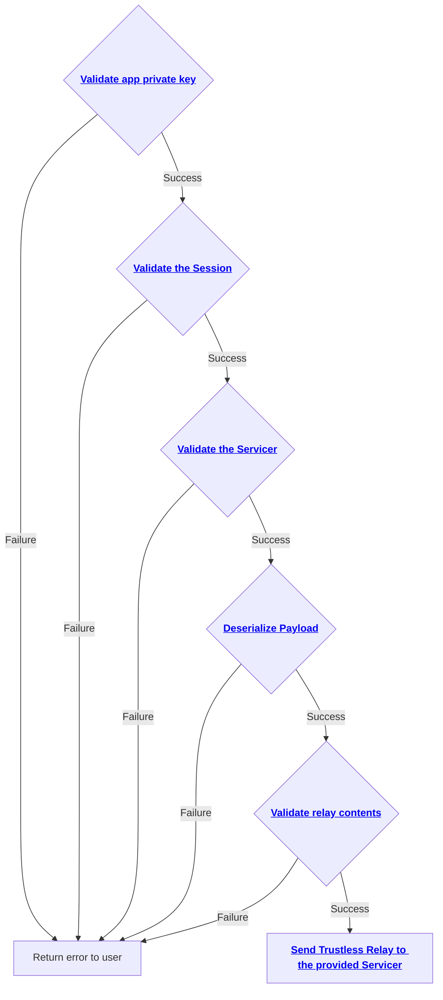
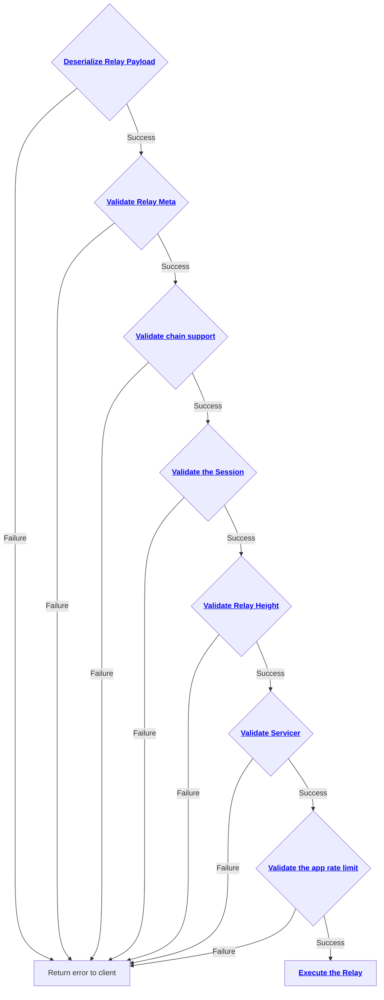

# Validation of Trustless Relays

## Client-side Relay Validation

When an application requests to send a trustless relay, the CLI performs several checks on the relay before sending it to the specified servicer.
The following diagram lists all these checks with links to the corresponding code secion (or an issue if the check is not implemented yet).

## Server-side Relay Validation

Once a trustless relay has been received on the server side, i.e. by the servicer, several validations are performed on the relay. 
The following diagram outlines all these checks along with links to the corresponding section of the code (or to an issue if the check has not been implemented yet)

