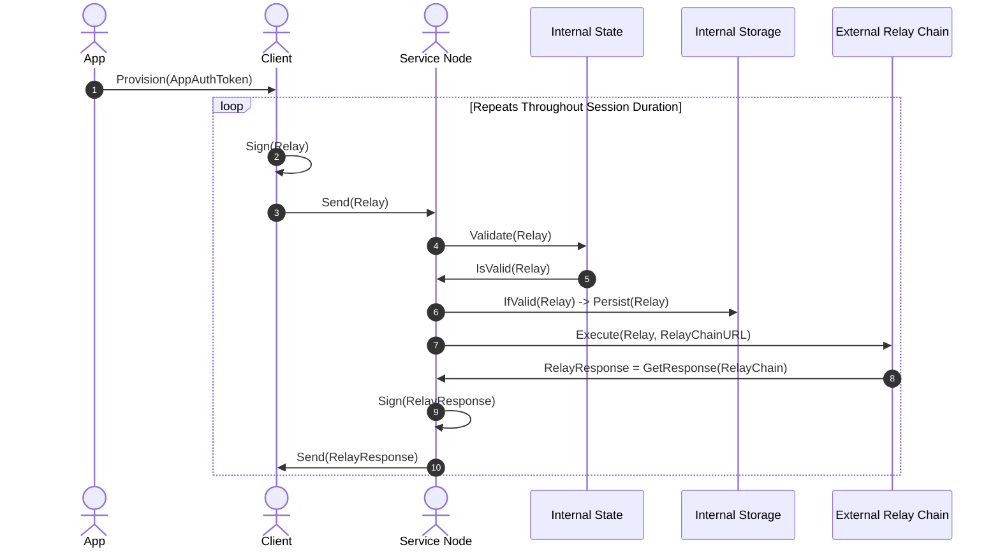
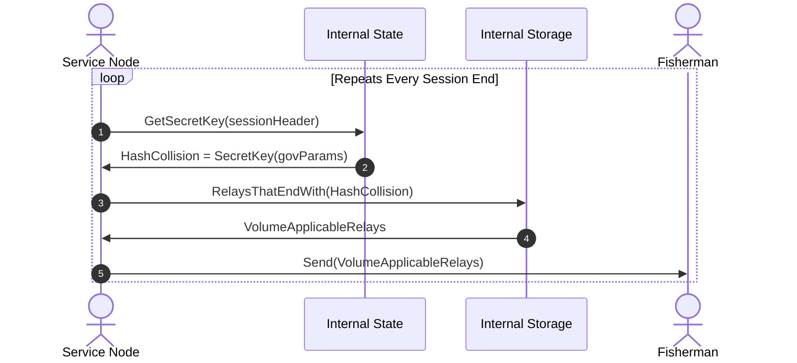
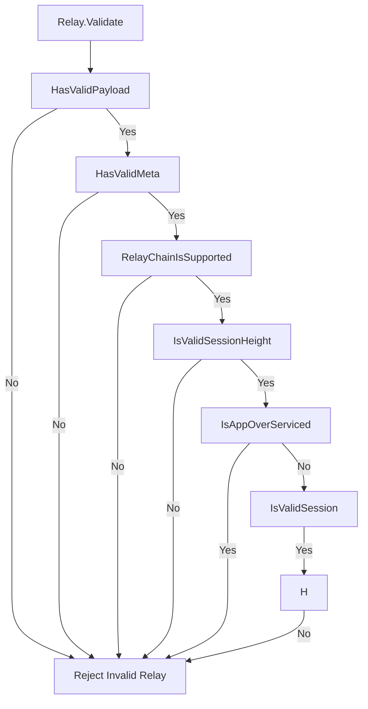
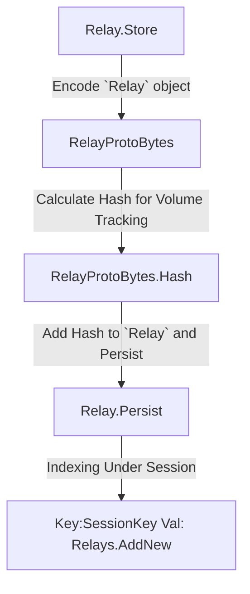
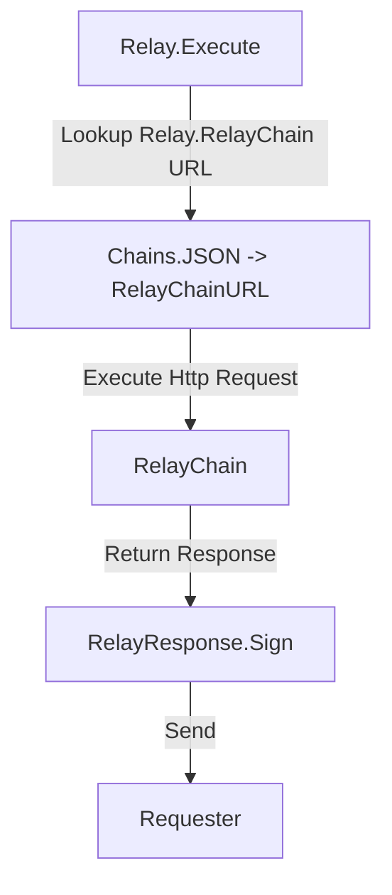

# Relay Protocol

### Background

The Relay Protocol is a fundamental sequence that makes up the building blocks of Pocket Network's Utility.

In Pocket Network, a Relay is a Read or Write API request operation to a 3rd part `RelayChain`.

The Relay Protocol is the servicing lifecycle that poises staked ServiceNodes to be able to complete
Relays on behalf of the network.

### Lifecycle

The foundational lifecycle of the Relay Protocol is:

1) Validate the inbound `Relay`
2) Store / persist the `Relay`
3) Execute the Relay against the `RelayChain`

4) Wait for `Session` end / secret key to be revealed
5) Collect Volume Applicable Relays (based on secret key) from storage
6) Report Volume Applicable Relays to the assigned `Fisherman`

### Validate the inbound `Relay`

A 11 step validation process to validate a submitted relay by a client before servicing

1) Validate payload, look for empty or 'bad' request data
2) Validate the metadata, look for empty or 'bad' metadata
3) Ensure the `RelayChain` is supported locally (within chains.json file)
4) Ensure session block height is current
5) Get the `sessionContext` to observe the world state at that version
6) Get the application object from the `r.AAT()` (using `sessionContext`)
7) Get session node count from that session height (using `sessionContext`)
8) Get maximum possible relays for the application (using `sessionContext`)
9) Ensure not over serviced (if max relays is exceeded, not compensated for further work)
10) Generate the session from seed data (see Session Protocol)
11) Validate self against the session (is node within session)

### Store the `Relay`

Store a submitted `Relay` by a client for volume tracking

1) Marshal `Relay` object into protoBytes
2) Calculate the `hashOf(protoBytes)` <needed for volume tracking>
3) Persist `Relay` object, indexing under session

### Execute the `Relay`

Execute a submitted `Relay` against the `RelayChain` by a client after validation

1) Retrieve the `RelayChain` url from chains.json file
2) Execute http request with the `Relay Payload`
3) Format and digitally sign the response
4) Send back to client

##### Wait for Session to end / secret key to be revealed

It's important to note, the secret key isn't revealed by the network until the session is over
to prevent volume based bias. The secret key is usually a pseudorandom selection using the block hash as a seed. 
(See the session protocol)

### Get volume metric applicable `Relays` from store

1) Pull all `Relays` whose hash collides with the revealed secret key

`SELECT * from RELAY where HashOf(relay) ends with hashEndWith AND sessionBlockHeight=sessionBlockHeight`

2) This function also signifies deleting the non-volume-applicable `Relays`

### Report volume metric applicable relays to `Fisherman`

1) All volume applicable relays need to be sent to the assigned trusted `Fisherman` for a proper verification of the volume completed.
2) Send `volumeRelays` to `fishermanServiceURL` through http.

##### Alt Design

NOTE: an alternative design is a 2 step, claim - proof lifecycle where the individual service nodes
build a merkle sum index tree from all the relays, submits a root and subsequent merkle proof to the
network.

Pros: Can report volume metrics directly to the chain in a trustless fashion

Cons: Large chain bloat, non-trivial compute requirement for creation of claim/proof transactions and trees, 
non-trivial compute requirement to process claim / proofs during ApplyBlock()